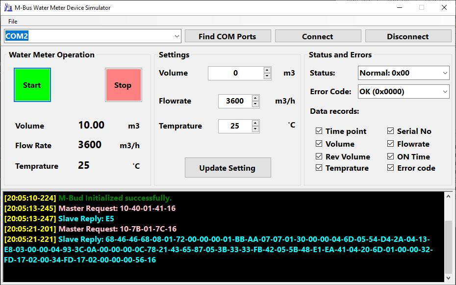
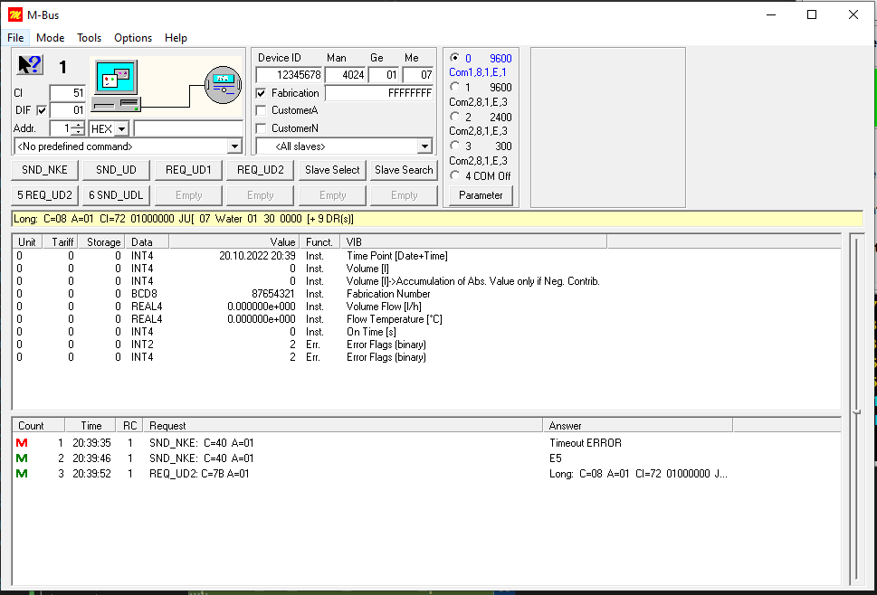

# Wired MBus Water Meter Simulator
Wired M-Bus Water Meter Device Simulator 

  
  

# Project goals
  - Simple Wired M-Bus software device for testing M-bus protocol
  - Study communication protocol between M-Bus master and M-Bus slave

# Water Meter Features
  - Simple software M-Bus water meter 
  - Support Volume, Flowrate, Temprature 
  - Support M-Bus master requests 

# How to use 
  - Build and run on windows 10 using visual studio 2022 .Net5
  - Need .Net5 desktop runtime to execute on wondows
  - Serial port configuration : Baud 9600, Data 8, Parity Even, Stop 1
  - Click start button to start water meter simulator
  - You can use <a hfer=https://michaelrac.com/downloads/#1612439083019-fb1b3e8b-8523> free M-Bus softwate </a> as M-Bus master 
  - 

 
